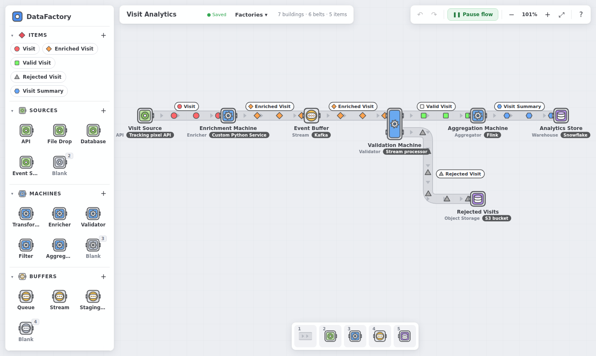

# DataFactory

Design and understand data pipelines visually, the way you'd lay out a factory in a
building game. Sources feed machines, machines feed buffers, buffers feed stores,
and the data (your *items*) rides along conveyor belts between them.



## Getting started

```bash
npm install
npm run dev        # http://localhost:5173
```

Other scripts: `npm run build` (typecheck + production build to `dist/`),
`npm test` (unit tests), `npm run typecheck`.

On first launch the app opens the example **Visit Analytics** factory. Use
**Factories ▾ → New empty factory** to start from scratch.

## Building blocks

| Block | Role | Ports |
| --- | --- | --- |
| **Item** | The data flowing through the factory (`Visit`, `Order`, `File`…) | — |
| **Source** | Where data originates | output side |
| **Machine** | Transforms, enriches, validates, filters, aggregates… | input side + output side |
| **Buffer** | Temporarily holds or transports data between machines | input side + output side |
| **Store** | Where processed data ends up | input side |

Every building is made of 1×1 blocks, like belt tiles. Buildings of the same kind
that touch on any side are always one structure: placing, moving, nudging or
rotating one against another merges them. The larger one keeps its name, type,
technology and facing. That
lets you build **any shape**: rows, L-shapes, squares, T-shapes, even rings. A
building is drawn as one outlined shape, and every exposed face on its output side
is an output port (every exposed face on its input side is an input port). The
example's validator is two blocks: one output carries valid visits, the other
rejected ones. Destroying a block that holds a shape together splits it into
separate buildings. `R` rotates the whole shape. Buildings of different types
placed directly in front of each other hand items over without a belt.

Buffers and stores are drawn as **tanks**, not machines: fully rounded vessels
(one block is round, a row is a capsule) held in the same square frame as other
buildings, so belts meet a flat edge. Buffers show their queued items through
a round window in each block. Stores carry the storage symbol.

### Icons

Any building can show an icon from the bundled set of 71 (in `src/assets/icons`)
instead of its kind's symbol: databases, queues, clouds, languages, tools and
shapez-style machines. Pick one under **Icon** in the building's inspector. The
grid is searchable. Component types in the palette can carry an icon too, and
every building made from that type gets it. The starter types come with generic
icons. Icons are drawn inline, so they stay sharp at any zoom and appear in PNG/GIF
exports.

### Combining item looks

A machine can build the look of what it produces from what it consumes, like
shapez's stacker, painter and mixer. In the machine's inspector, **Combine** has
four modes. Inputs are lettered A, B, … in order, and **⇄ Reorder** changes which
one is A.

| Mode | Output looks like |
| --- | --- |
| Own | Whatever look you give the output item |
| Stack | A at the bottom, B stacked on top (a yellow star + an orange ball → a star with a ball on it) |
| Paint | A's shape in B's colour |
| Mix | A's shape with all the input colours mixed as light (red + green → yellow) |

The machine's output items take that look on every belt, and it updates when the
inputs change, including through chains of combining machines. Set the machine
back to *Own* and the items return to their own shape and colour.

The app is **technology-agnostic**. Nothing is built in for any specific tool.
Every building has:

- **Name**, e.g. `Visit Enricher`
- **Type**, the role it plays (`Transformer`, `Queue`, `Warehouse`, or anything you type)
- **Technology**, free text such as `Kafka`, `Snowflake` or `Custom Python Service`,
  stored as metadata only
- **Description**, **inputs**, **outputs** (item types), **colour** and arbitrary
  **metadata** key/value pairs

The palette comes with a few generic types per block (API, Transformer, Queue,
Warehouse…). Add your own with the **+** next to each section, for example a Buffer
type called `Events Queue` with default technology `Kafka`. Items get a shape, a
colour, a description and an optional field schema.

## Controls

It plays like shapez.io: pick a tool, left-click to build, right-click to destroy.

| Action | How |
| --- | --- |
| Pick a tool | Hotbar at the bottom: `1` Belt, `2` Source, `3` Machine, `4` Buffer, `5` Store, `6` Link. Clicking a palette tile picks that component type |
| Build | Left-click the floor, or left-drag to paint blocks. Matching blocks that touch join into one building of any shape. A ghost shows where it will go and turns red when something is in the way |
| Rotate | `R` / `Shift R` rotates the tool, the selected buildings, or the belt under the cursor |
| Lay belts | With the belt tool, left-drag: each tile is laid as the cursor enters its cell, pointing the way you move; changing direction turns the tile behind into a corner (as in shapez) |
| Connect | Items leave a building from the side with outward arrow tabs and enter from the side with inward tabs. A belt from one building's output side into another's input side connects them. A belt that stops short shows a red end |
| Destroy | Right-click, or right-drag to destroy several things |
| Put the tool away | Right-click empty floor, or `Esc` |
| Pipette | `Q` or a middle click picks up the building (with all its settings) or belt under the cursor as the tool; middle-drag still pans |
| Choose what a belt carries | Drag an item from the palette onto the belt, or click the belt and pick it in the inspector |
| Select / move | With no tool, click a building and drag it. `Shift`+drag a box to select buildings and belts together, then drag or nudge them with the arrow keys |
| Duplicate / delete | `Ctrl D` / `Del` |
| Undo / redo | `Ctrl Z` / `Ctrl Shift Z` |
| Pan / zoom | Drag the floor, `WASD`, `Space`+drag or the middle mouse button / scroll, `+` `−`, `F` to fit |
| See what a belt carries | Hover the belt (or select it) to show its item label |
| Highlight a flow | Hover an item in the palette to see every belt and building that handles it |
| Pause the animation | `P` or **Pause flow** |
| Dark / light mode | The ☾ / ☀ button in the top bar (starts from your system setting, then remembers your choice) |

Press `?` in the app for the full list.

## Links

Some relationships aren't items on a belt: a service that *reads from* a queue
and a bucket, or a lookup. The **Link** tool (`6`, the arrow in the hotbar) draws
these as arrows. Drag from one building onto another. A building can point at as
many others as you like. Click an arrow to give it a label (e.g. "reads from"),
change its colour, make it dashed or flip its direction. Right-click an arrow to
delete it. A building's inspector lists the arrows to and from it.

## Exporting images

**Export ▾** in the top bar saves the factory as a **PNG** (rendered at 2×) or an
animated **GIF** of items moving along the belts, which loops without a jump.
Either can cover the **whole factory** or a **selected area**: pick *Select an
area…* and drag a box over the floor (`Esc` or right-click cancels). Tick
*Include the grid* to keep the floor grid in the image. Exports use the current
light or dark theme and leave out selection and hover highlights.

## Saving

Factories autosave to your browser's `localStorage`, including where you were
looking. Factories saved by the first version, whose belts were abstract links,
get their belts laid out as tiles automatically when loaded. **Factories ▾** lists every saved factory and lets you open, delete,
export (`.factory.json`) and import them. Imports are validated and repaired, so a
hand-edited file with dangling references still loads.

## Deploy server

A server can follow the branches on its own, without GitHub Actions or webhooks:

| URL | Serves |
| --- | --- |
| `/` | a production build of `main` |
| `/dev/` | a production build of `dev`, with a small pill in the corner naming the channel, when the commit was made and its message (links to the commit) |

Run this once on the server (Ubuntu, as the user that should own the app):

```bash
curl -fsSL https://raw.githubusercontent.com/yume02kki/DataFactory/dev/deploy/install.sh | bash
```

It installs git, Node.js 22 and nginx if they're missing, clones both branches to
`~/datafactory/{main,dev}`, points nginx at the builds in `/var/www/datafactory`,
and sets up `datafactory-sync`, a timer that checks GitHub every 30 seconds. When
a branch has new commits it pulls them, runs `npm ci` if dependencies changed,
builds, and swaps the new build in. A push is live within about a minute. If a
build fails, the site keeps its previous version and that commit isn't retried
until the branch moves again. The two sites keep separate saved factories in the
browser, so trying something on `/dev` can't disturb the factories on `/`.

```bash
journalctl -u datafactory-sync -f        # watch deploys
sudo systemctl start datafactory-sync    # check for new pushes right now
```

Settings can be passed to the installer as environment variables: `BASE`, `WWW`,
`PORT`, `INTERVAL`. Running it again is safe and updates the setup.

## Project layout

```
src/
  model/        types, defaults & example, geometry (grid, footprints, faces), ops (belt tracing, placement), storage
  store/        zustand store with undo/redo history
  components/   Canvas (SVG floor), NodeView/BuildingArt, BeltView, Palette, Inspector, TopBar
  lib/          viewport helpers, text measuring, colour utils
```

Built with React, TypeScript, Vite, zustand and immer. The canvas is plain SVG.
Belts are stored as individual grid tiles. Which buildings they connect is worked
out by following the tiles from an output face until they enter an input face.
Items move along those traced lines with SMIL `animateMotion`. The colour palette
follows shapez.io's light theme. No shapez assets are used.
